Light-weight PC Emulator
========================
Neko's x86 Virtual Machine, a portable x86 PC emulator with debugger  
Author: Xu Ha (cshaxu@gmail.com)

Introduction
------------
This project includes an integrated implementation of a light-weight x86 PC emulator, which is written in 40,000 lines of C codes and a few Assembly codes.

It emulated a PC machine which serves as a software container. The emulator has an Intel 80386 CPU and all other necessary devices, such as RAM, DMA, PIC, Floppy, Hard Drive, Keyboard, Display and so on.

Therefore it supports the operating systems based on x86, such as MS-DOS.  

MS-DOS running in HMA  
  

NXVM Running on ARM Platform (Microsoft Surface RT 8.0)  
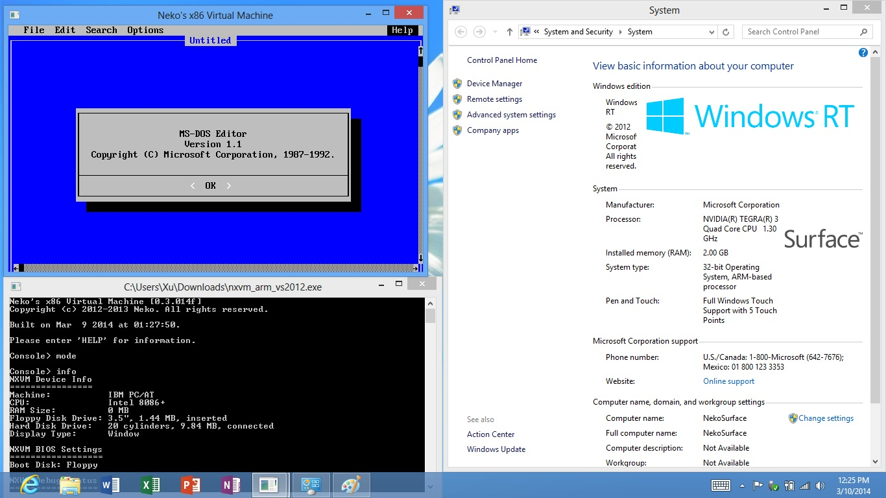  

Platform
--------
### Windows
The emulator provides two modes of display: Win32 Console and Win32 App Window.  
In the previous mode, the keyboard and display are emulated using Win32 Console APIs, while in the later mode, emulator accepts input and provides output using a Window controlled by message loop.

MS-DOS running in Win32 Console  
  

The Win32 App Window mode is preferred for two reasons:  
1. The bitmap font used in MS-DOS is applied in Win32 App Window Mode.  
2. The NXVM console window still exists and won't be overrided by NXVM display.  

Win32 App Window Mode with Bitmap Font  
  
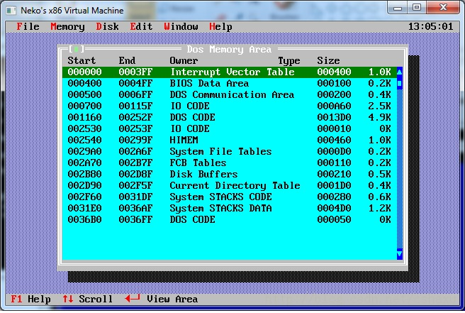  

### Linux
The emulator runs in a terminal window of at least 80x25 size. It works like Win32 Console mode. It has some known issues which are not yet fixed.  

MS-DOS running in Linux Terminal  
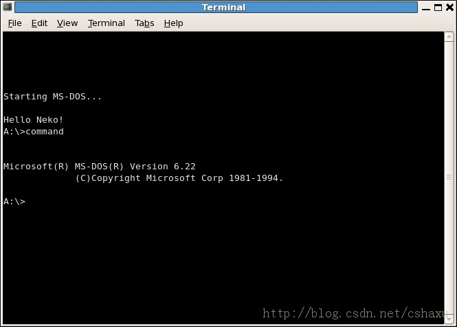  
MS-DOS Editor in Linux Terminal  
  

Compiling
---------
The compiling options are defined in `src/global.h`, to specify 32/64 bit compilation. It also has a macro to specify the platform WIN32/LINUX. In most cases, user doesn't need to change anything there.

### Windows
For Visual Studio 2008 or higher:  
Create an empty Win32 Console project and add all `.c` and `.h` files from the folders:  
- src  
- src/device  
- src/device/qdx  
- src/platform  
- src/platform/win32  
- src/xasm32  

For MinGW:  
1. In `global.h`, replace `#ifdef _WIN32` with `#ifdef _WIN32_DISABLED`.  
2. Install MinGW.  
3. Download PDCurses 3.4 (pdc34dllw.zip, Win32 DLL for console w/ Unicode) from Sourceforge.com.  
4. Add files to %MINGW_HOME%:  
- pdcurses.lib -> %MINGW_HOME%/lib/ncurses.lib  
- cursors.h -> %MINGW_HOME%/include/cursors.h  
- panels.h -> %MINGW_HOME%/include/panels.h  
- pdcures.dll -> %MINGW_HOME%/bin/pdcures.dll  
5. Run `mingw32-make`.  

### Linux
1. Install `ncurses` and `pthread` if they do not exist.  
2. Change directory to NXVM project folder.  
3. Type `./configure` to check libraries and generate makefile.  
4. Type `make` to build NXVM. Output binary is `nxvm` in project folder.  
5. Type `./nxvm` to run NXVM.  

Quick Start
-----------
1. Prepare for a 1.44MB floppy disk image file as the startup disk.  
2. Start NXVM and type `help` for available commands.  
3. Type `device fdd insert <filename>` to load the floppy disk image file into NXVM floppy drive.  
4. Type `mode` to switch display mode(Win32 Console/Win32 App Window).  
5. Type `info` to learn about emulator status.  
6. Type `start` to start machine.  
7. Type `stop` under Win32 App Window mode, or press `F9` at anytime to stop emulation.  
8. The emulation can be resumed by `resume` command in NXVM console.  

Components
----------
### Console
- Main Entry and Version Label (src/main.c)  
- Virtual Machine Console (src/console.ch)  

VM console provides a command-line interface which accepts user input and provides machine information.  

Emulator Status Info  
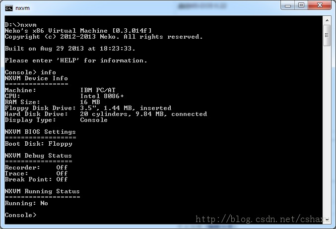  

### Emulator Itself
- Platform-related Components (src/platform/)  
- Basic I/O System (src/device/vbios.ch)  
- Hardware Emulation Modules (src/device/vmachine.ch)  

The emulator is divided into 3 parts: Hardware Emulation, BIOS and Platform-related Part.

Hardware Emulation is the "hardware" part, which provides the hardware logic of all the devices emulated.  
Basic I/O System is the "software" part, which provides POST and interrupt service routines.  
Platform-related Part basically provides keyboard and display, and it is designed to work with different operating systems.

### Debugger
NXVM is NOT just an emulator. It does more than simply emulating a PC. Users may debug an operating system in NXVM using debugger.

##### Debugger Console (src/debug.ch, src/device/vdebug.ch)
The debugger is used to test and debug the guest operating system running inside NXVM.

User may print/modify CPU registers, print/modify/search/compare/fill/watch RAM area, operate device through I/O ports, trace/dump CPU instructions and set breakpoints.

NXVM has both 16-bit and 32-bit debugger support. The command usage of 16-bit debugger is almost the same as the MS-DOS debugger, and all the memory addresses are represented in physical address. The 32-bit debugger uses linear address format. The help command `?` introduces all available commands supported.

NXVM Internal Debugger  
  

##### Assembler/Disassembler
- i386 Assembler (src/xasm32/aasm32.ch)  
- i386 Disassembler (src/xasm32/dasm32.ch)  

The emulator includes an integral assembler and disassembler. They translates Assembly codes from/to machine codes. All Intel-format x86 instructions are supported.  
The assembler and disassembler are used as a part of debugger, which provides readable instructions to user.

Applications
------------
Some legacy MS-DOS applications are supported in NXVM.  

Turbo C 2.0  
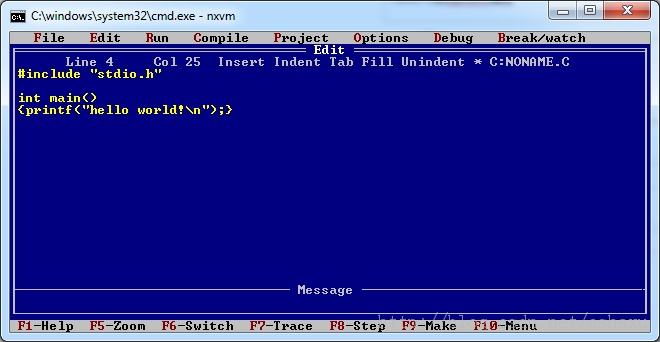  
MS-DOS Defrag  
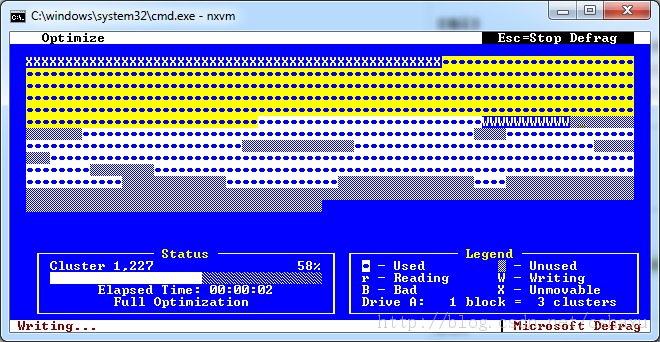  
MS-DOS Editor for Windows 95 (32-bit Instructions Applied)  
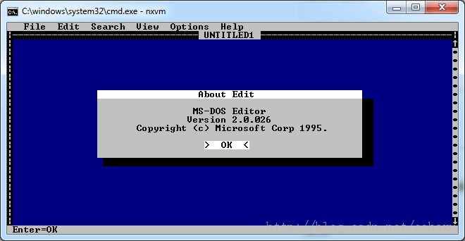  
MS-DOS Anti Virus  
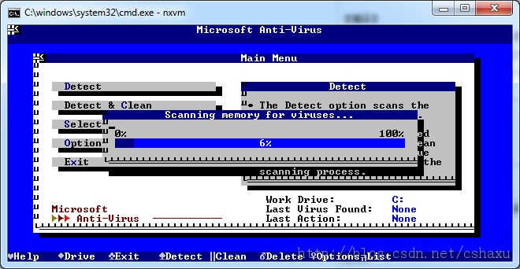  
Type Tutor (TT)  
  
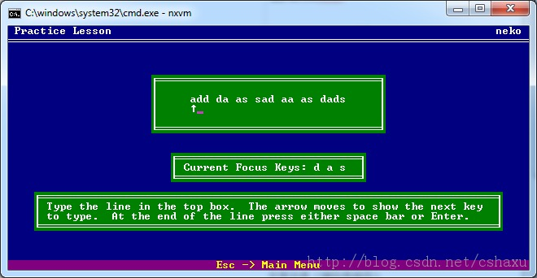  
Tetris (NYET)  
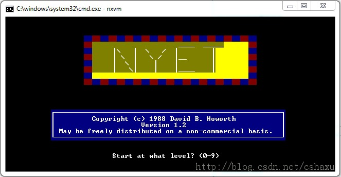  
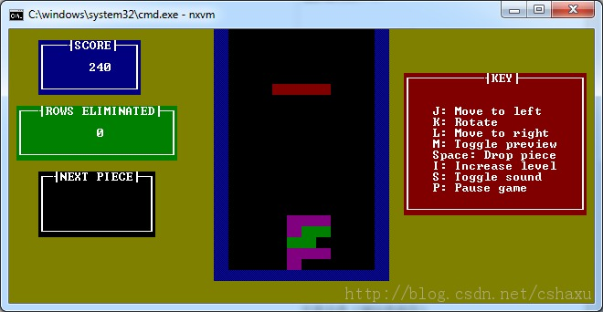  

References
----------
[Bochs Project](http://bochs.sourceforge.net/)  
easyVM 0.2  
LightMachine 0.5  
Intel 80386 Reference Manual  
IA-32 Intel Architecture Software Developer's Manual Volume 1: Basic Architecture  
IA-32 Intel Architecture Software Developer's Manual Volume 2: Instruction Set Reference  
IA-32 Intel Architecture Software Developer's Manual Volume 3: System Programming Guide  
NCURSES-Programming-HOWTO  
IBM PC/AT 5170 Technical Reference (1985)  
and more ...
