# NXVM

Neko's x86 Virtual Machine is a portable x86 PC emulator with an integrated
debugger. NXVM is the repository's current, bootable whole-machine product.
Its codebase is also being evolved into a shared, evidence-led machine
foundation for the future NXVDM DOS application product; NXVDM is not yet a
runnable release product.

## Introduction

NXVM emulates an Intel 80386 PC with the machine services needed for the
current product: RAM, DMA, PIC, floppy and hard disks, keyboard, display, BIOS
behavior, and a debugger. It is useful both as a bootable virtual machine and
as a controlled environment for examining legacy x86 software.

The screenshots below are historical NXVM product captures retained from the
original project README. They illustrate the product's lineage; they are not
current compatibility claims and include no guest media or executables.

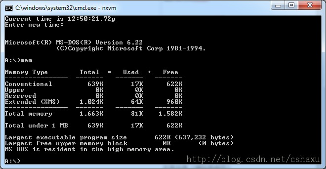

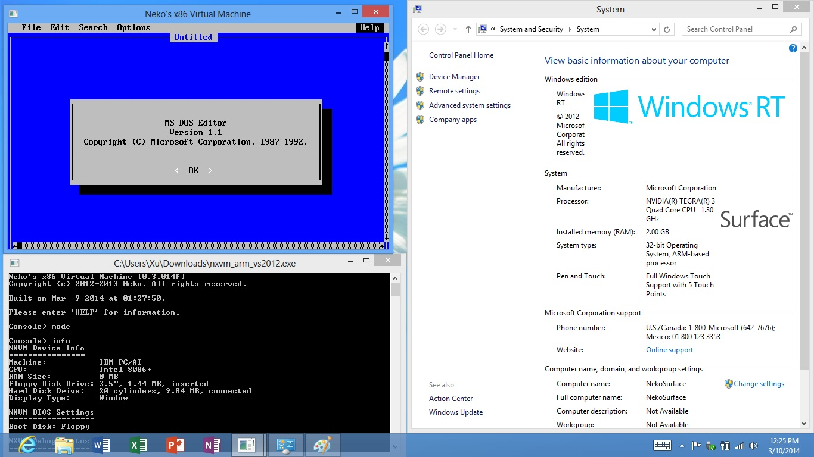

## Platform

### Windows

NXVM provides Console and application-window presentation paths. The windowed
path keeps the NXVM control Console separate from the guest display.

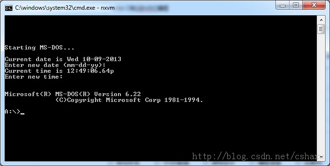

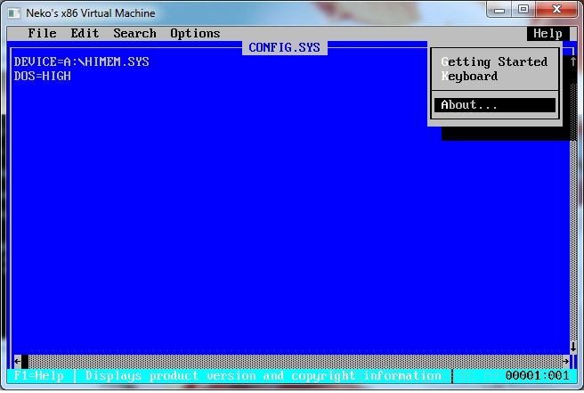

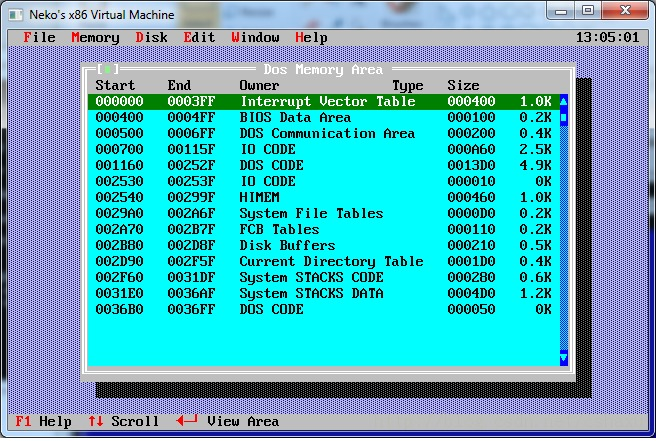

### Linux

Linux support uses the terminal presentation path. It remains a development
and verification surface; see the project documentation for current support
boundaries.

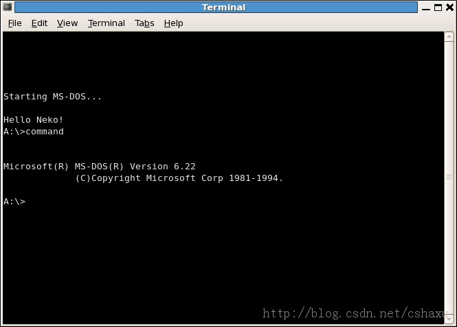

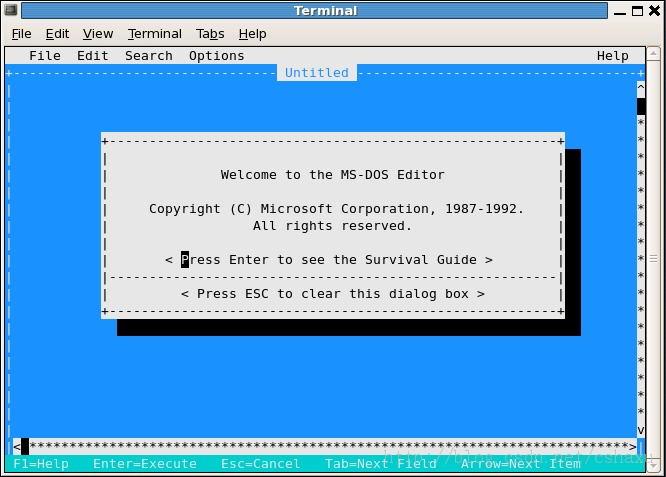

## Build

The supported development path is 64-bit MinGW-w64 GCC, CMake 3.23 or later,
and Ninja on Windows. Ensure `gcc` and `ninja` are available on `PATH`, then
from the repository root run:

```powershell
cmake --preset mingw-gcc-x64-release
cmake --build --preset current-gcc
```

The current developer x64 artifact is copied to `build/output/` after a
successful build. Task closure also emits the corresponding `_x86.exe` from
the same source target using the documented x86 MinGW-w64 preset. Run the
current project gates with:

```powershell
cmake --build --preset current-gates-gcc
```

When `ccache` is installed, an optional isolated repeat-build route is:

```powershell
cmake --preset mingw-gcc-x64-ccache
cmake --build --preset current-gcc-ccache
```

Visual Studio is not required for the supported development path. The legacy
manual-project, Autotools, and Makefile instructions are retired.

## Quick Start

1. Build NXVM using the commands above.
2. Start the generated `nxvm_0_5_NNNN_x64.exe` or `nxvm_0_5_NNNN_x86.exe`
   developer artifact from
   `build/output/`.
3. In the NXVM Console, use `help` to inspect available commands.
4. Supply only your own legally obtained boot media when experimenting with a
   guest; the repository does not provide or distribute guest media.
5. Use the Console and debugger to inspect machine state, then start, stop,
   and resume the session as supported by the current command surface.

The exact current product and media boundaries are maintained in the
[documentation guide](docs/README.md) and its linked authorities.

## Components

### Console and machine

NXVM combines a bootable machine composition, firmware/profile behavior,
platform presentation, and the retained Console/debugger experience. The
shared `core` foundation owns reusable guest-machine behavior; NXVM owns the
current product composition and user experience.

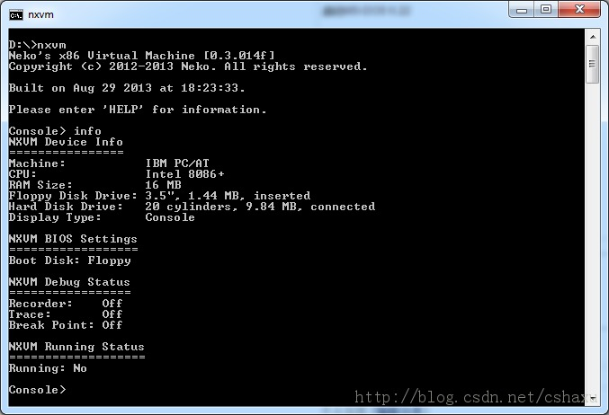

### Debugger

NXVM includes an integrated debugger for examining guest registers, memory,
ports, breakpoints, watchpoints, and instruction execution. Its assembler and
disassembler remain part of that debugging experience.

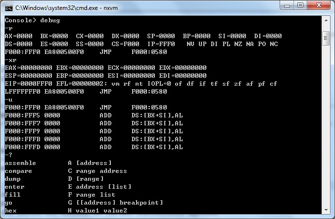

## Historical application captures

These original NXVM captures are retained for project history and visual
context, not as a claim that every displayed application is currently tested
or supported.

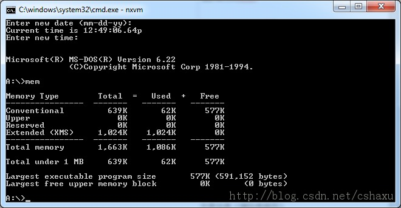

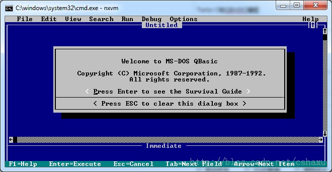

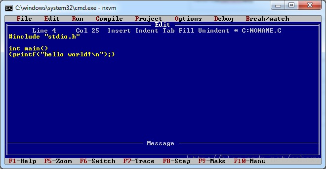

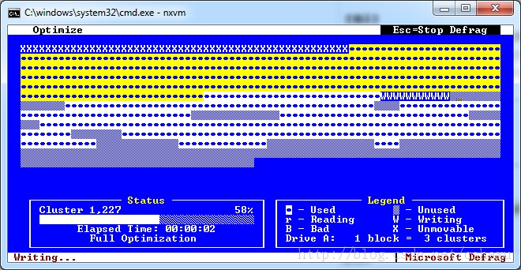

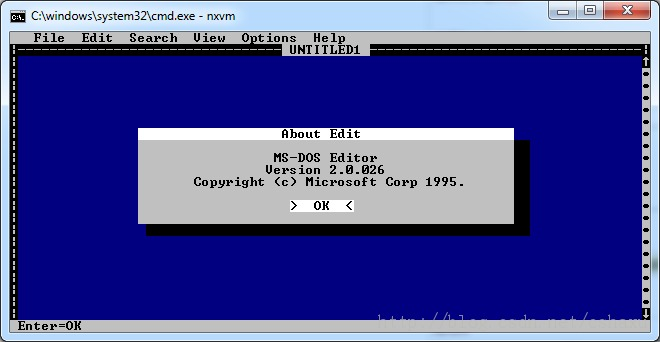

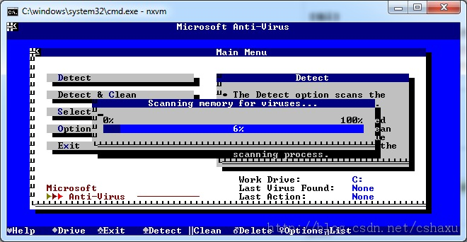

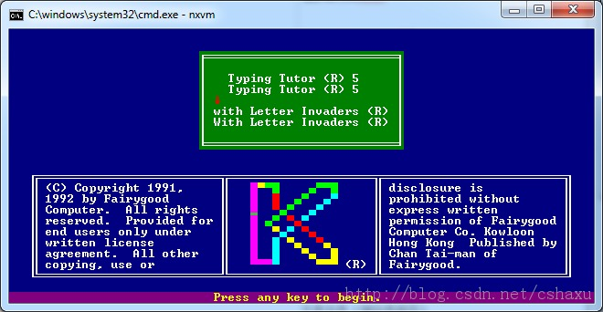

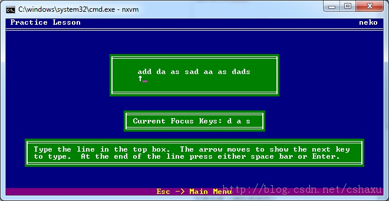

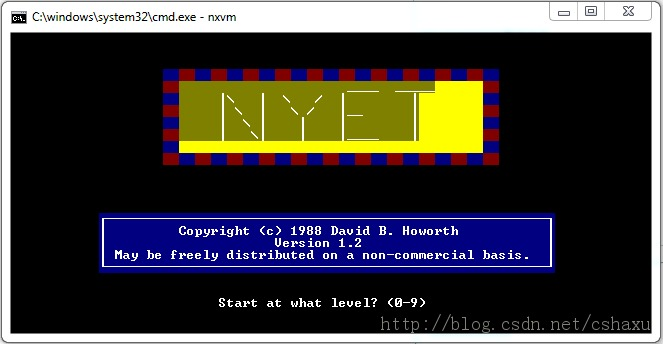

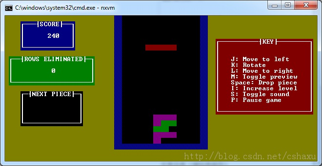

## Start Here

- [Documentation Guide](docs/README.md) is the contributor and agent entry
  point.
- [Project Goals](docs/design/GOAL.md), [System Architecture](docs/design/ARCHITECTURE.md),
  and [Roadmap](docs/design/ROADMAP.md) describe the current NXVM-first,
  two-product direction.
- [Contributing](CONTRIBUTING.md) describes the change and review process.

## Project Boundary

NXVM is the present product; the shared foundation may later support NXVDM
without making it a current runtime promise. Source, firmware, guest media,
research, and distribution constraints are defined by the local documentation
authorities. Read [AGENTS.md](AGENTS.md) before changing the repository.

## References

The project is informed by Intel 80386 architecture documentation, IBM PC/AT
technical references, and other documented research sources. See the
[documentation guide](docs/README.md) for the current source and research
boundaries.
